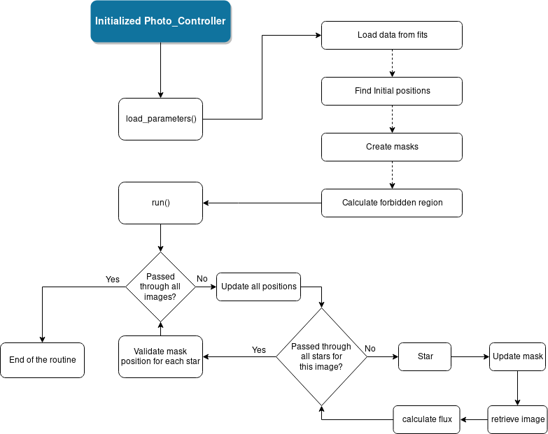
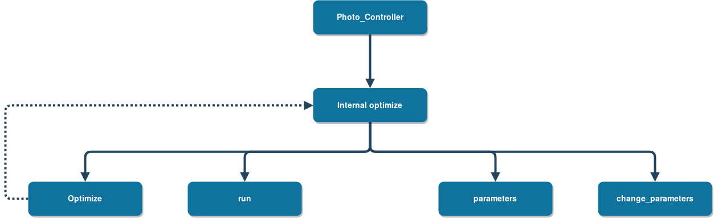

A Quick Overview
========================

In this package, as we have stated, we implemented aperture photometry to all of the background stars, that are not analysed 
during the official data reduction pipeline, for the CHEOPS mission. 

The aperture photometry method, is schematized in the following figure, using some of the terms that will be presented in the near future. 

   Diagram of the photometry process. 

The presented diagram assumes that the optimization routine has already happened, which may not be true. Further details on the optimziation 
steps are provided in Section :ref:`optimization`

The Photo_Controller is what controls the flow of the method, providing an easy interface for the user of the library. This "Controller" is also
schematized in the following image, and the functions are explained in the Section :ref:`photo_controller`

   Diagram of the photometry controller. 

If you do not wish to read the entire documentation, it's possible to jump right into the Section :ref:`LC_extract`, where a simple  use case is given,
and a small discussion is made on how we can access the data either from memory and from disk, after saving it.